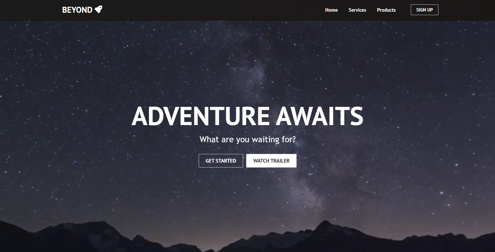
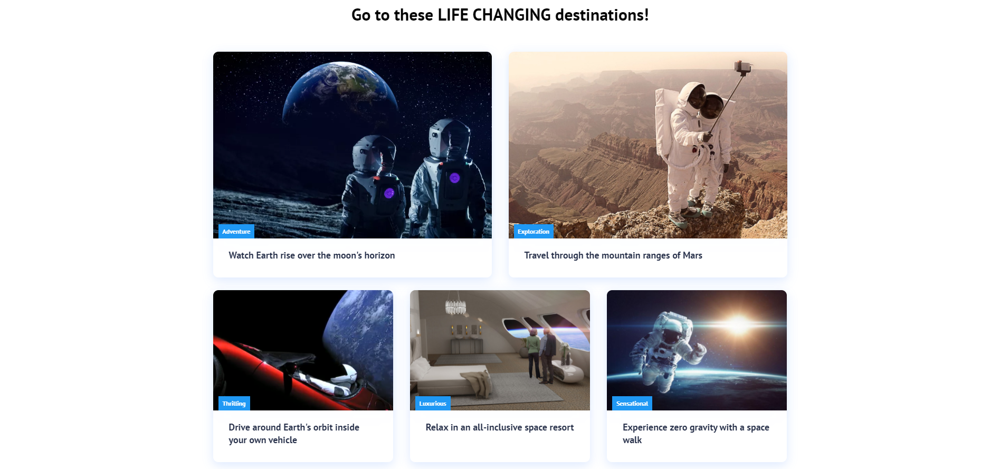
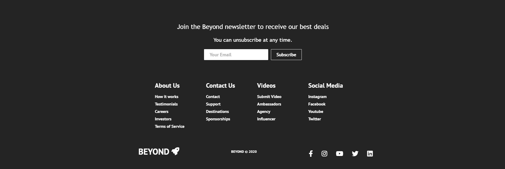
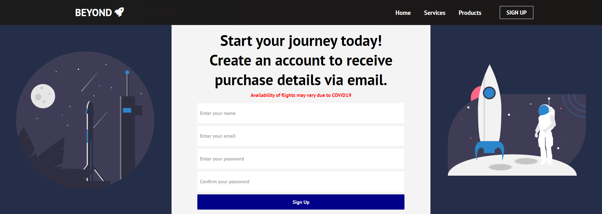

# Beyond
A simple Kotlin React web client.

## Home Page

## Sign-up Page

## Features

- Responsive buttons and images make the website feel alive
- Mobile-friendly user interface changes based on the screen dimensions
- Video background in home page
- Easily customizable

## To Run

Use the `browserDevelopmentRun` or `run` Gradle task provided.

 

Inspired by [Brian Codex's Repository](https://github.com/briancodex/react-website-v1/tree/starter)